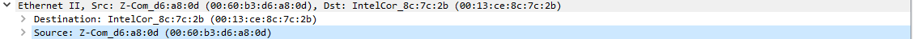
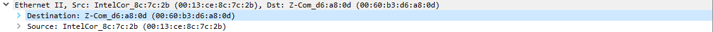
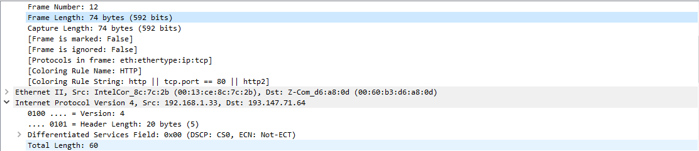
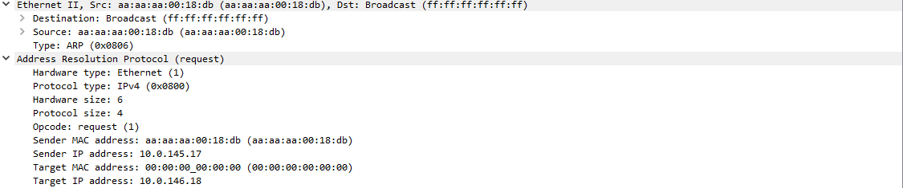
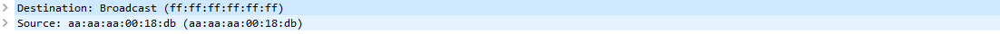
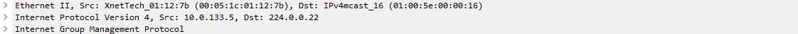
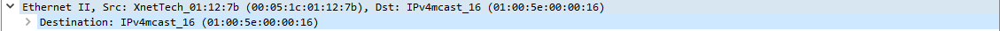

# Ejercicio 1

- Observa el primer paquete o trama capturada. ¿Qué protocolos se van encapsulando de manera sucesiva?
  1. Ethernet.
  2. IP.
  3. TCP.
  - 
- ¿Cuál es la dirección MAC de origen de la trama 10?
  - 
  - MAC: `00:60:b3:d6:a8:0d`.
- ¿Cuál es la dirección MAC de destino de la trama 11?
  - 
  - MAC: `00:60:b3:d6:a8:0d`.
- Observa el paquete número 12. ¿Qué tamaño tiene? ¿Es coherente con lo que aparece en el encapsulado?
  - 
  - Tiene un tamaño de 74 bytes.
  - 
  - Son 74 bytes totales, y 60 de la IPv4.
- ¿Qué tipo de protocolo encapsula la trama 15?
  - 
  - El protocolo es HTTP.

# Ejercicio 2

- Observa el paquete 28. ¿Qué protocolos se van encapsulando de manera sucesiva?
  - 
  - Ethernet y ARP.
- ¿Cuál es la dirección MAC de origen y de destino de la trama 28?
  - 
  - Se envía a todos los dispotivos que estén en escucha y viene de la dirección `aa:aa:aa:00:18:db`.
- Observa el paquete 8. ¿Qué protocolos se van encapsulando de manera sucesiva?
  - 
  - Se encapsula Ethernet, IPv4, y IGMP.
- ¿Cuál es la dirección MAC de destino la trama 8?
  - 
  - MAC: `01:00:5e:00:00:16`.
