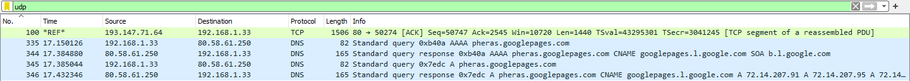
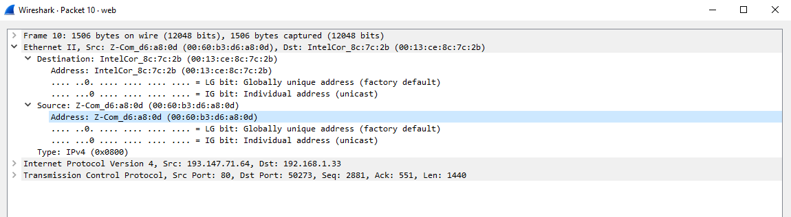
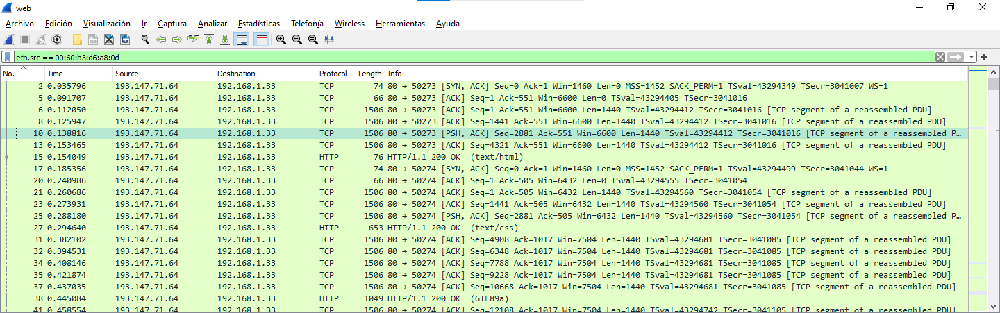
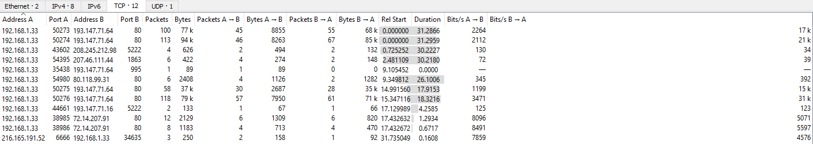
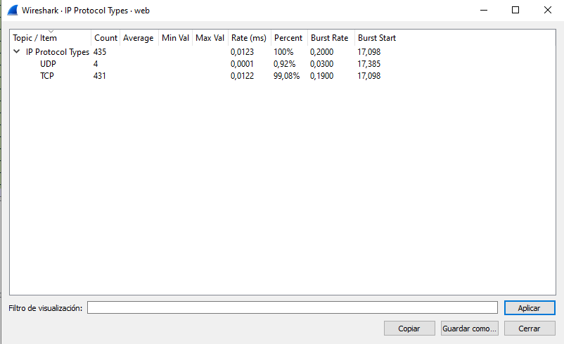

- Ve al paquete 100, fija la referencia temporal en dicho paquete, ve al paquete 200 y observa cuánto tiempo ha transcurrido entre uno y otro.
  - 
  - Han pasado 4.710223 segundos desde entonces.
- Aplica un filtro en que se seleccionen solamente los paquetes UDP.
  - la
- Aplica un filtro en que se seleccionen todas la tramas que tengan como dirección MAC de origen la de  trama 10.
  - 
  - 
- Ve al menú de estadísticas y apunta cuántas conversaciones TCP ha habido en la captura.
  - 
- ¿Cuántos paquetes TCP ha habido en la captura?
  - 
  - 431 paquetes.